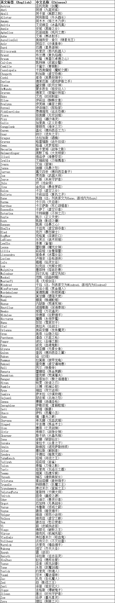
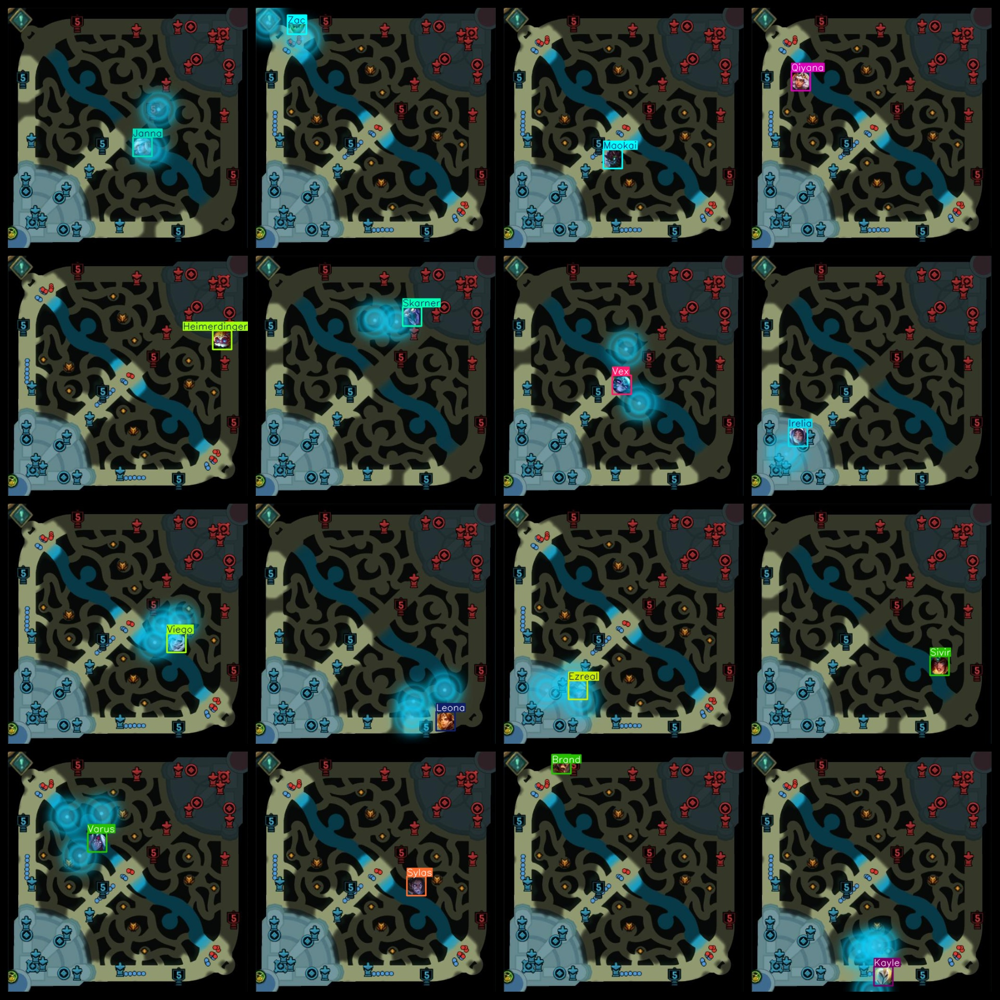

# League of Legends Small Map Hero Corner Color Recognition Detection Dataset 9813 images159-classVOC+YOLO format

League of Legends Minimap Hero Character Recognition Detection Dataset 9813 Sheets 159 Class VOC + YOLO Format

Dataset Description: The image is the top-left corner of the League of Legends game, displaying the detection and recognition of circular images of heroes.

Dataset format: Pascal VOC format + YOLO format (the txt file does not contain the split path, it only contains jpg images and corresponding VOC format xml files and yolo format txt files)

Number of image files: 9813

Number of XML files: 9813

Number of txt files: 9813

Tagged as: 159

The Github repository is: datasets_sl

Annotation class names: ["Aatrox","Ahri","Akali","Alistar","Amumu","Anivia","Annie","Aphelios","Ashe","AurelionSol","Azir","Bard","Blitzcrank","Brand","Braum","Caitlyn","Camille","Cassiopeia","Chogath","Corki","Darius","Diana","DrMundo","Draven","Ekko","Elise","Evelynn","Ezreal","Fiddlesticks","Fiora","Fizz","Galio","Gangplank","Garen","Gnar","Gragas","Graves","Gwen","Hecarim","Heimerdinger","Illaoi","Irelia","Ivern","Janna","Jarvan","Jax","Jayce","Jhin","Jinx","Kaisa","Kalista","Kane","Karma","Karthus","Kassadin","Katarina","Kayle","Kayn","Kennen","KhaZix","Kled","KogMaw","LeBlanc","LeeSin","Leona","Lillia","Lissandra","Lucian","Lulu","Lux","Malphite","Malzahar","Maokai","MasterYi","Mindred","MissFortune","Mordekaiser","Morgana","Nami","Nasus","Nautilus","Neeko","Nidalee","Nocturne","Nunu","Olaf","Orianna","Ornn","Pantheon","Poppy","Pyke","Qiyana","Quinn","Rakan","Rammus","Reksai","Rell","Renata","Renekton","Rengar","Riven","Rumble","Ryze","Samira","Sejuani","Senna","Seraphine","Sett","Shaco","Shen","Shyvana","Singed","Sion","Sivir","Skarner","Sona","Soraka","Swain","Sylas","Syndra","TahmKench","Taliyah","Talon","Taric","Teemo","Thresh","Tristana","Trundle","Tryndamere","TwistedFate","Twitch","Udyr","Urgot","Varus","Vayne","Veigar","Velkoz","Vex","Vi","Viego","Viktor","Vladimir","Volibear","Warwick","Wukong","Xayah","Xerath","XinZhao","Yasuo","Yone","Yorick","Yuumi","Zac","Zed","Zeri","Ziggs","Zilean","Zoe","Zyra"]

Number of boxes labeled in each category:

The number of Aatrox frames is 62.

Ahri Frames = 62

The number of Akalis in the box is 61.

Alistar Frame Count = 62

Amumu's Frames = 61

Anivia frame count = 62

Annie's frame count = 62

The number of Aphelios frames is 62.

Ashe frame count = 62

AurelionSol frame count = 62

Azir's frame count = 62

Bard frame count = 62

Blitzcrank Frame Count = 62

Brand frame count = 62

Brauman box number = 60

Caitlyn frame count = 62

Camille Frame Count = 62

Cassiopeia Frame Number = 62

The number of Chogath frames is 62.

Corki frame count = 62

Darius's box count = 62

Diana Frame Count = 62

DrMundo's frame count = 62

Drave's Frame Count = 61

Ekko frame count = 62

Elise frame count = 62

Evelyn Frame Count = 61

Ezreal's Frame Count = 62

Fiddlesticks Frame Count = 62

【Fiora Frames】 = 62

Fizz Frames = 62

The number of Galio frames is 62.

Gangplank frame number = 62

Garen's frame count = 62

Gnar Frame Count = 62

Gragas Frames = 61

Graves' Frame Count = 62

Gwen's box count = 60

Hecarim Frames = 61

Heimerdinger Frame Number = 62

Illaoi Frame Count = 62

The number of IRElia frames = 62

Ivern box count = 61

Janna's frame count = 62

Jarvan's Frame Count = 61

Jax Frames = 62

Jayce Frames = 62

Jhin frame count = 61

Jinx box number = 62

Kaisa Frames = 61

The number of Kalista boxes is 61.

Kane box = 62

Karma Frame Count = 62

Karthus Frame Count = 62

Kassadin Frames = 62

Katarina Frames = 62

Kayle's box number = 62

Kayn box number = 62

Kennen Frames = 62

KhaZix frame count = 60

Kled Frames = 62

KogMaw Frames = 62

LeBlanc box number = 62

The number of LeeSin boxes is 62.

Leona's box count = 62

Lillia Frame Count = 61

Lissandra frame count = 62

Lucian's box number = 62

Lulu's frame count = 62

Luminance Frame Number = 62

Malphite's frame count = 62

The number of rectangles is Malzahar box = 61

Maokai Frames = 60

The number of frames in MasterYi is 62.

【Mindred Frames = 61】

MissFortune frame count = 62

Mordekaiser frame = 61

Morgana's frame count = 62

Nami's number of frames = 62

Nasus Frame Count = 62

Nautilus frame count = 62

Neeko Frames = 62

Nidalee frame count = 62

Nocturne Frames = 62

Nunu frame = 62

Olaf's frame number = 62

Orianna frame count = 62

Ornn Frame Count = 62

Pantheon frame count = 62

Poppy frame count = 62

Pyke frame count = 62

Qiyana frame count = 62

Quinn Frame Count = 61

Rakan's frame count = 62

Rammus frame count = 62

Reksai frame count = 62

Rell box = 62

Renata Frames = 62

Renegont frame number = 62

Rengar frame count = 62

Riven's frame count = 61

Rumble frame count = 62

Ryze frame count = 61

Samira's frame count = 62

Sejuani frame count = 62

Senna Frame Count = 61

Seraphine Frame Count = 61

Sett Frame Number = 62

Shaco frame count = 62

Shen frame count = 62

The answer cannot be determined as the question is not complete.

Singed frame count = 62

Sion frame count = 62

Sivir box = 62

Skarner Frame Count = 62

Sona Frames = 62

Soraka's box count = 62

Swain frame count = 61

Sylas Frame Count = 62

Syndra Frames = 62

TahmKench's Frame Count = 62

Taliyah frame count = 62

Talon box count = 62

The number of Taric frames = 60

Teemo's Frame Count = 62

Threshold Frames = 62

Tristana frame count = 61

Trundle Frame Number = 62

Tryndamere frame count = 61

The twisted fate frame number is 62.

Twitch Frames = 62

Udyr's frame count = 62

The number of Urgot frames is 62.

Varus frame count = 61

Vayne's frame number = 62

Veigar frame count = 61

Velkoz frame count = 62

Vex box number = 62

Vi Frames = 62

Viego Frame Count = 61

The number of Viktor frames = 62

Vladimir's box number = 62

Volibear Frame Count = 61

Warwick Frame Count = 62

Wukong's Frame Count = 61

【Xayah Frame Count = 62】

Xerath frame count = 61

【XinZhao】Number of Frames = 62

Yasuo Frame Count = 62

Yone Frames = 61

Yorick Frames = 62

Yumi's number of frames = 62

Zac's frame count = 61

Zed Frames = 61

Zeri Frame Count = 62

Ziggs Frame Count = 60

Zilean frame count = 62

Zoe's frame count = 62

Zyra Frame Count = 61

Total frames: 9813

Number of images per category:

Aatrox's Ownership Count = 62

Ahri's Photo Count = 62

Akali has 61 images

Alistar holds 62 images.

Amumu has 61 images.

Anivia owns 62 images.

Annie has 62 pictures.

Aphelios's number of pictures = 62

Ashe owns 62 pictures.

AurelionSol's Image Count = 62

Azir's possession of images = 62

Bard holds 62 pictures.

Blitzcrank owns 62 images.

Brand occupies 62 images.

Braum's possession count = 60

Caitlyn has 62 pictures.

Camille owns 62 images.

Cassiopeia has 62 images.

Chogath's possession of images = 62

Corki's possession of images = 62

Darius's possession count = 62

Diana has 62 pictures

DrMundo's occupancy of images = 62

Draven's possession of images = 61

Ekko's possession count = 62

Elise's count of images = 62

Evelynn has 61 photos.

Ezreal owns 62 images.

Fiddlesticks has 62 images.

Fiora has 62 photos.

Fizz occupies a picture count = 62

Galio has 62 images.

Gangplank's possession count = 62

Garen has 62 images.

Gnar owns 62 images.

Gragas's number of pictures = 61

Graves' Ownership Count = 62

Gwen's possession of pictures = 60

Hecarim's possession count = 61

Heimerdinger's occupational image count = 62

Illaoi owns 62 images.

Irelia has 62 pictures.

Ivern owns 61 pictures.

Janna holds a picture = 62

Jarvan has 61 pictures

Jax has 62 images.

Jayce's possession count = 62

Jhin's possession of images = 61

Jinx's possession of images = 62

Kaisa has 61 images.

Kalista's possession of pictures = 61

Kane's Picture Count = 62

Karma's possession of picture numbers = 62

Karthus has 62 pictures.

Kassadin has 62 pictures.

Katarina has 62 images.

Kayle holds 62 photos.

Kayn's ownership count = 62

The number of photographs possessed = 62

KhaZix owns 60 images.

Kled's possession of pictures = 62

KogMaw has 62 images.

LeBlanc owns 62 images.

LeeSin owns 62 images.

Leona has 62 pictures

Lillia has 61 images.

Lissandra's possession of images = 62

Lucian's Picture Number = 62

Lulu's possession of image count = 62

Lux occupies 62 images.

Malphite owns a picture count = 62

Malzahar has 61 pictures

Maokai's possession of pictures = 60

MasterYi holds a number of 62 images.

Mindred owns the image count = 61

MissFortune's possession of images = 62

Mordekaiser's Claims Image Count = 61

Morgana has 62 images

Nami owns 62 pictures.

Nasus occupies 62 pictures.

Nautilus has 62 photos

Neeko owns 62 pictures.

Nidalee has 62 pictures.

Nocturne has 62 images.

Nunu's possession of pictures = 62

Olaf has 62 pictures.

Orianna has a total of 62 images.

Ornn's number of pictures = 62

The number of images owned by Pantheon = 62

Poppy's possession of image count = 62

Pyke's possession of images = 62

Qiyana's possession of images = 62

Quinn has 61 images

Rakan has 62 pictures.

Rammus has 62 pictures

Reksai has 62 pictures.

Rell's possession of images = 62

Renata's picture count = 62

Renegekton has 62 pictures

Rengar has 62 pictures

Riven's Ownership of Image Count = 61

Rumble occupies a total of 62 images.

Ryze's Photograph Count = 61

Samira's possession of pictures = 62

Sejuani's possession of images = 62

Senna owns 61 photos.

Seraphine owns 61 images.

Sett occupies a picture count = 62

Shaco has 62 image counts.

Shen's possession of images = 62

Shyvana's possession of images = 62

Singed occupies a total of 62 images.

Sion owns a photo count = 62

Sivir owns 62 images.

Skarner has 62 images

Sona's possession of pictures = 62

Soraka's Picture Count = 62

Swain's possession count = 61

Sylas's picture count = 62

Syndra has 62 images.

TahmKench owns 62 images.

Taliyah's possession of images = 62

Talon occupies the image count = 62

Taric's Photograph Count = 60

Teemo has 62 images.

Thresh's possession of pictures = 62

Tristana's possession count = 61

Trundle has 62 images.

Tryndamere's possession count = 61

TwistedFate has 62 images.

The number of Twitch's pictures = 62

Udyr's picture count = 62

Urgot occupies 62 pictures.

Varus occupancy = 61

Vayne's possession of images = 62

Veigar has 61 images.

Velkoz has 62 images.

Vex's ownership of images = 62

Vi has 62 images.

Viego's possession count = 61

Viktor has 62 pictures

Vladimir's number of images = 62

Volibear's Image Count = 61

Warwick holds 62 pictures.

Wukong occupies 61 images.

Xayah's possession of images = 62

Xerath has 61 images.

XinZhao owns 62 images.

Yasuo's Ownership of Pictures = 62

Yone's possession of pictures = 61

Yorick's possession of pictures = 62

Yuumi owns 62 pictures.

Zac has 61 pictures

Zed owns 61 images.

Zeri has 62 pictures

Ziggs's count of images = 60

Zilean owns 62 pictures.

Zoe has 62 images.

Zyra's possession of image counts = 61

Image resolution: 509x506

Use the labeling tool: labelImg

Dataset Augmentation: No

Rules for annotation: Draw a rectangle around the category.

Important note: The dataset does not have been divided into training, validation, and testing sets.

Special Disclaimer: This dataset does not guarantee the accuracy of the trained models or weight files.

Annotation and image details are as follows:

## Images

---

Here is a pay link on Stripe (https://buy.stripe.com/3cs8yP7sY87d0vu9AB). Please contact me lonlonago@foxmail.com after funding $89, and I will send you a complete data files, thank you!

